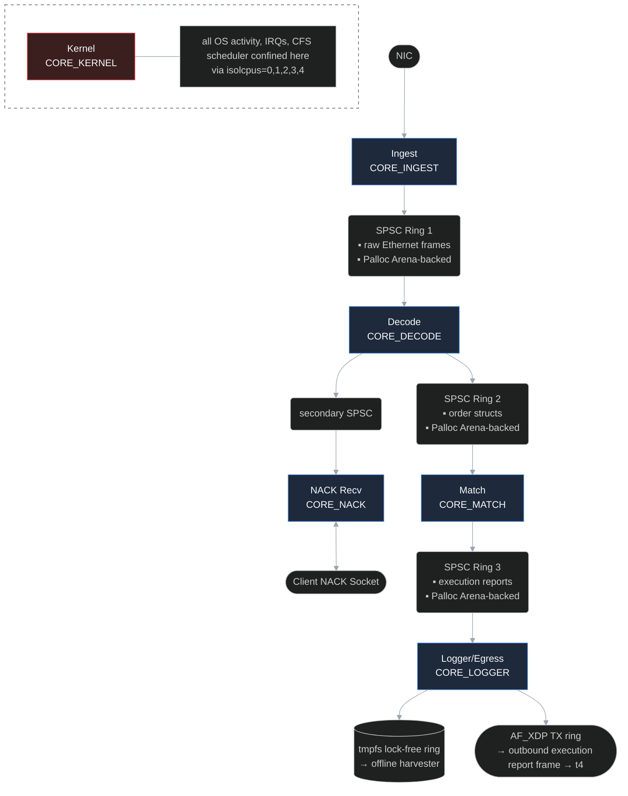

# Project Peregrine — Comprehensive Reference Document

> **Status:** Living document. All architecture, engineering rules, and style decisions herein are authoritative for every line of code written in this project. This is a **learning project**. The owner writes all code. The engineering partner provides guidance, explains hardware phenomena, reviews small code blocks, and ensures architectural decisions are made correctly — not as a code generator for bulk implementation.

---

## Table of Contents

1. [Project Overview](#1-project-overview)
2. [System Architecture](#2-system-architecture)
3. [The Five Server Threads](#3-the-five-server-threads)
4. [SPSC Ring Buffers](#4-spsc-ring-buffers)
5. [Order Book Design](#5-order-book-design)
6. [Network Layer](#6-network-layer)
7. [NACK Protocol](#7-nack-protocol)
8. [TSC Infrastructure](#8-tsc-infrastructure)
9. [Logger and Egress](#9-logger-and-egress)
10. [Palloc Integration](#10-palloc-integration)
11. [Build System](#11-build-system)
12. [Target Hardware and OS Configuration](#12-target-hardware-and-os-configuration)
13. [Benchmarking Suite](#13-benchmarking-suite)
14. [Engineering Rules and Code Generation Constraints](#14-engineering-rules-and-code-generation-constraints)
15. [Interaction Style and Partner Guidelines](#15-interaction-style-and-partner-guidelines)

---

## 1. Project Overview

Project Peregrine is a low-latency HFT market data and matching engine simulation modeled after real exchange infrastructure (CME, NASDAQ). It consists of two binaries on two separate machines:

- **`peregrine-server`** — the exchange matching engine. This is the system under measurement. Everything measured is server-internal only.
- **`peregrine-client`** — the HFT order generator. Fires UDP packets as fast as possible. Its performance is not measured.

**The latency being benchmarked** is strictly server-internal: from the instant a packet's first byte lands on the server NIC (timestamped `t0`) to the instant an execution report is submitted to the outbound TX ring (`t4`). This is exactly how real exchanges define and publish their own gateway-to-match latency figures.

The client runs unpinned on a separate machine with no special OS configuration. The server runs a five-thread strictly-linear pinned pipeline on a headless, fully optimized Arch Linux installation.

---

## 2. System Architecture

### Pipeline Flow



### Two-Machine Rationale

Running the order generator on the same machine as the matching engine would pollute the engine's L2/L3 cache with the generator's instruction and data working set, producing artificially degraded latency numbers. With five cores pinned on the server, an 8-core machine has only three cores left — insufficient to saturate a physical network link cleanly while simultaneously running OS overhead. Architecturally, separate machines is simply correct: in real co-location infrastructure, HFT firms run on physically separate hardware connected by dedicated cross-connects.

### Dev Mode vs Bench Mode

In **dev mode**, all five server threads share one core with the kernel. Thread pinning is compiled out entirely via `USE_THREAD_PINNING`. Latency output is suppressed — numbers in dev mode are meaningless and must not be quoted. The network backend in dev mode is `recvmmsg` over a `veth` pair on the same machine.

In **bench mode**, each thread is pinned to its own isolated core, the `recvmmsg` backend is active (or AF_XDP as opt-in), and full telemetry is produced.

---

## 3. The Five Server Threads

Each thread owns exactly one stage of the pipeline. No thread touches another thread's stage. Handoffs happen exclusively through SPSC ring buffers.

### Thread 0 — Ingest (`CORE_INGEST`)

**Responsibility:** Receive raw Ethernet frames from the NIC and push them into SPSC Ring 1.

- Runs the network receive loop. In bench mode with AF_XDP enabled: polls the AF_XDP Rx ring in user space via `XDP_USE_NEED_WAKEUP`. In syscall fallback mode: `recvmmsg` batched receive loop.
- Both paths are hidden behind a **network backend wrapper** (see Section 6). Ingest calls the wrapper — the implementation selected at compile time.
- Immediately after a frame is confirmed present (DMA write visible), inserts an `_mm_lfence()` to prevent the CPU from speculatively reading packet data before the DMA transfer is complete.
- Stamps `t0` via `__rdtscp(&aux)` immediately after the lfence — this is the authoritative NIC-arrival timestamp.
- Pushes the raw frame into SPSC Ring 1.
- In AF_XDP mode, uses `SO_BUSY_POLL` on the AF_XDP socket to keep the NIC driver's poll routine active in user space, preventing the kernel from masking hardware interrupts and putting the driver to sleep between packets.

### Thread 1 — Decode (`CORE_DECODE`)

**Responsibility:** Parse raw frames into typed `order` structs and push them into SPSC Ring 2.

- Reads raw frames from SPSC Ring 1.
- Manually parses the Ethernet header (14 bytes), IP header (20 bytes), and UDP header (8 bytes) — the kernel network stack is bypassed entirely, so headers must be parsed by hand via struct casting.
- Validates destination port. Extracts the payload.
- Reads the 8-byte sequence number (`uint64_t`). Tracks highest seen. Detects gaps.
- On gap detection: pushes a NACK request into the secondary lightweight SPSC to NACK Recv.
- Issues `_mm_prefetch` hints immediately after an order packet is identified, pulling the targeted price-level cache line(s) into L1 before the `order` struct reaches the Match thread. This eliminates the "cold book" cache miss on the Match core.
- Stamps `t1` via `__rdtscp(&aux)`.
- Constructs an `order` struct (allocated from Palloc Pool) and pushes into SPSC Ring 2.

### Thread 2 — Match (`CORE_MATCH`)

**Responsibility:** Execute the order book matching logic and push execution reports into SPSC Ring 3.

- Reads `order` structs from SPSC Ring 2.
- Runs the flat-array order book and FIFO matching logic (see Section 5).
- Stamps `t2` via `__rdtscp(&aux)`.
- Constructs an execution report and pushes into SPSC Ring 3.

### Thread 3 — Logger/Egress (`CORE_LOGGER`)

**Responsibility:** Persist execution reports, record telemetry, and emit the outbound response frame.

- Reads execution reports from SPSC Ring 3.
- Stamps `t3` via `__rdtscp(&aux)` upon receipt.
- Writes the execution report into a pre-allocated slot in a lock-free circular ring buffer that is memory-mapped directly onto a `tmpfs` (RAM disk) file. No `writev`, no kernel file I/O on the hot path. An offline process harvests from this ring asynchronously.
- Binary format only: raw TSC ticks stored as `uint64_t`. No string formatting, no `sprintf`, no stream operators on the hot path.
- Submits the outbound execution report frame to the AF_XDP TX ring descriptor (or the syscall equivalent).
- Stamps `t4` via `__rdtscp(&aux)` immediately before the TX ring descriptor submission — this is the wire-to-wire egress boundary timestamp.
- Feeds `latency_sample{t0, t1, t2, t3, t4}` into the pre-allocated HdrHistogram sample ring (Palloc Arena-backed).

### Thread 4 — NACK Recv (`CORE_NACK`)

**Responsibility:** Handle gap recovery independently of the main pipeline.

- Polls a dedicated NACK socket independently of the pipeline rings.
- Receives NACK requests from Decode via the secondary lightweight SPSC.
- Sends a NACK packet back to the client specifying `gap_start` and `gap_end` sequence numbers.
- Holds the server's retransmit ring buffer (Palloc Arena-backed): a fixed-size circular buffer of the last N sent frames. Replays the requested range on demand.
- Communicates with Decode only through the secondary SPSC — never touches the main pipeline rings.

### Thread 5 — Kernel (`CORE_KERNEL`)

Not an application thread. All OS activity, hardware IRQs, and the CFS scheduler are confined to this core via the `isolcpus` boot parameter. In dev mode, all five application threads also share this core.

---

## 4. SPSC Ring Buffers

Three main rings connect the pipeline stages. One secondary ring connects Decode to NACK Recv. All ring storage arrays are allocated from Palloc Arena at startup.

### Design Properties

- **Power-of-two capacity.** Enables index masking with `& (capacity - 1)` instead of modulo — no division on the hot path.
- **False-sharing elimination.** `head` and `tail` pointers live on **separate 64-byte cache lines** (`alignas(64)`). Without this, every producer write to `head` invalidates the cache line holding `tail` on the consumer core, creating a cache-line ping-pong that dominates latency. Same problem solved in Palloc's concurrent slab.
- **No CAS.** The producer is the only writer of `head`. The consumer is the only writer of `tail`. Single-writer per index means no compare-and-swap is needed — a plain store/load with the correct memory ordering is sufficient.
- **Ordering semantics.** Producer: `store(std::memory_order_release)` on `head` after writing payload. Consumer: `load(std::memory_order_acquire)` on `head` before reading payload. The release/acquire pair establishes the happens-before relationship that makes payload data visible to the consumer without additional barriers in most cases.
- **Compiler barriers.** Explicit `asm volatile("" ::: "memory")` compiler fences are placed around index updates to guarantee that the compiler does not reorder payload writes across the index store. This is distinct from the CPU memory ordering — both are required.
- **Palloc Arena backing.** The storage array is a single contiguous allocation from Palloc Arena at startup. Fixed lifetime for the session. No per-element allocation or free on the hot path.

---

## 5. Order Book Design

### Flat Array Structure

The order book is a flat C array: `price_level levels[MAX_TICKS]`. A resting order at price `p` maps to array index `p - base_price` — a single subtraction and array dereference. No pointer chasing. No tree traversal. The hot price range (typically a few hundred ticks around the current market) stays resident in L2 cache.

`MAX_TICKS` is a power of two (e.g., 8192 or 16384).

### Array Bounds Safety Without Branches

**Never** use a conditional branch to bounds-check the price index. Branches introduce branch predictor pressure and, in pathological cases, misprediction penalties. Instead, clip the index with a bitwise mask:

```cpp
// price is int64_t in fixed-point tick units
// cast to size_t only at the indexing step
const size_t idx = static_cast<size_t>(price - base_price) & (MAX_TICKS - 1u);
price_level& level = levels[idx];
```

This is valid only because `MAX_TICKS` is a power of two. The mask replaces the modulo and simultaneously clamps any out-of-range value to a valid index. Malformed prices wrap to a stale level rather than overflowing. For the bench profile, prices are validated upstream in Decode before they reach Match, so the mask serves as a hardware-level safety net, not primary validation.

### Bitset for Best-Price Scan

The order book uses `AL::bitmap` (from Palloc) to track which price levels have resting orders. Bit `w*64 + i` is set when price level `base + w*64 + i` has resting quantity. Insert and cancel are a single `set_slot`/`clear_slot` call. Best-bid and best-ask scans go through `alloc_bit`.

Since Match is single-threaded, compile Palloc with `PALLOC_SINGLE_THREADED` for this component so the bitmap's atomics reduce to plain loads and stores with no `LOCK`-prefixed instructions.

---

### FIFO Matching

On an aggressive order (buy whose price ≥ best ask, or sell whose price ≤ best bid): consume resting quantity from the best price level in strict arrival order until the aggressor is fully filled or the book is exhausted at that price. Update the bitset if a price level's quantity reaches zero. FIFO rewards speed — the first resting order at a price is always the first to trade.

### Fixed-Point Prices

All prices are `int64_t` in units of the minimum tick. Example: at 0.01 tick size, price $100.10 is stored as `10010`. Never use `float` or `double` for prices. IEEE 754 cannot represent `100.10` exactly in binary — repeated addition accumulates error and the result is non-associative (`a + b + c ≠ a + c + b`), which is unacceptable for a matching engine. Fixed-point arithmetic on `int64_t` is exact, associative, and maps directly to hardware integer units with no FPU involvement.

Prices are stored globally as `int64_t`. They are cast to `size_t` exclusively at the array-indexing step. This prevents signed underflow wraps during distance calculations from silently producing enormous unsigned indices.

### Order Objects

All `order` objects are allocated from Palloc Pool. The Pool size class is tuned to `sizeof(order)` at startup. A pre-warmed pool for the maximum expected simultaneous resting orders is allocated at startup — zero `malloc` calls on the hot path during operation.

Each `price_level` holds a head and tail pointer to an **intrusive doubly-linked list** of resting `order` nodes. The `order` struct embeds `prev` and `next` pointers directly — no separate list container. Cancellation is O(1): splice the node out by relinking its neighbors, then return it to the Palloc Pool. This preserves strict FIFO time priority for all remaining orders at the level.

---

## 6. Network Layer

### Architecture: Wrapper-Based Backend Selection

AF_XDP is **opt-in**, not opt-out. The baseline network backend is `recvmmsg`. The Ingest thread never calls the backend directly — it calls a backend wrapper function. The wrapper's implementation is selected at compile time by the presence or absence of `NETWORK_BACKEND_AFXDP`. If the flag is absent, the syscall backend is compiled in. This design allows development and correctness testing on hardware that does not support AF_XDP without any code path changes in the Ingest thread.

```
NETWORK_BACKEND_AFXDP defined  →  wrapper calls AF_XDP Rx ring poll
NETWORK_BACKEND_AFXDP absent   →  wrapper calls recvmmsg batched receive
```

The Ingest thread sees one function signature in both cases.

### Syscall Backend: `recvmmsg`

`recvmmsg` batches multiple receive operations per syscall, reducing syscall overhead by 10–30× versus plain `recv`. The dev mode environment uses a `veth` pair (two virtual NICs connected back-to-back) to allow both binaries to run on the same machine for correctness testing.

Dev environment setup:
```bash
sudo ip link add veth0 type veth peer name veth1
sudo ip link set veth0 up && sudo ip link set veth1 up
sudo ip addr add 10.0.0.1/24 dev veth0
sudo ip addr add 10.0.0.2/24 dev veth1
```

### AF_XDP Backend

AF_XDP eliminates both kernel copies in the standard packet path. The normal path is: NIC DMA → kernel socket buffer → userspace (two copies, two context switches). AF_XDP replaces this entirely.

A UMEM is registered with the kernel — a contiguous page-aligned region allocated from Palloc Arena (hugepage-backed, as all Arena allocations in bench mode). The NIC DMA-writes packets directly into UMEM chunks. The Fill ring tells the kernel which chunks are available for receive. The Rx ring tells userspace which chunks contain received packets. The kernel acts only as a ring buffer coordinator — packet data never moves after the DMA write.

The Ingest thread loops over the Rx ring in userspace using `XDP_USE_NEED_WAKEUP`. After processing a frame, the chunk is recycled back to the Fill ring.

**`SO_BUSY_POLL`** is set on the AF_XDP socket with a custom timeout via `setsockopt(..., SOL_SOCKET, SO_BUSY_POLL, ...)`. This keeps the NIC driver's polling routine active in userspace continuously. Without it, the kernel may put the driver's poll routine to sleep between bursts, reintroducing the interrupt-delivery latency that AF_XDP is designed to avoid.

However, AF_XDP is opt-in. 

### UDP Protocol

Each UDP payload:

| Field | Size | Description |
|---|---|---|
| Sequence number | 8 bytes | `uint64_t`, monotonically increasing per session |
| Message type | 1 byte | New order / cancel / modify / NACK |
| Sender TSC | 8 bytes | Client-side timestamp (informational only, not used in server latency measurement) |
| Order payload | ≤ 32 bytes | Order fields |

No handshake. No per-packet ACK. No congestion control. NACK-based gap recovery only. This mirrors NASDAQ ITCH 5.0 and CME MDP 3.0. TCP is excluded because head-of-line blocking means a single lost packet stalls the entire receive stream while waiting for retransmission. In trading, a delayed order is often worse than a missing one — the signal has gone stale. NACK-based UDP allows the receiver to continue processing all in-order packets and selectively request retransmission of specific gaps.

---

## 7. NACK Protocol

### Server-Side Gap Detection and Recovery

1. Decode thread receives sequence number `N+2` after seeing `N`. The gap `[N+1, N+1]` is detected.
2. Decode pushes a NACK request `{gap_start, gap_end}` into the secondary SPSC to NACK Recv.
3. NACK Recv thread (core 4) sends a NACK packet back to the client: `{type=NACK, gap_start, gap_end}`.
4. NACK Recv also holds the server's retransmit ring buffer (Palloc Arena-backed) — a fixed-size circular buffer of the last N received frames. If the server needs to replay received frames (for diagnostic or protocol reasons), it does so from this buffer.

### Client-Side Retransmit

1. Client's secondary thread polls the NACK socket continuously.
2. On NACK receipt, the secondary thread replays the requested sequence range from the client's retransmit ring buffer (also Palloc Arena-backed) back to the server.
3. The retransmitted frames are tagged with the original sequence numbers so Decode can fill the gap correctly.

### Retransmit Ring Buffer Properties

Both the server and client retransmit ring buffers are Palloc Arena-backed. Fixed lifetime per session. No individual frees are needed — Arena is the appropriate allocator when the entire block is freed at once at session end.

---

## 8. TSC Infrastructure

### Calibration

At server startup, compare `__rdtscp` ticks against `clock_gettime(CLOCK_MONOTONIC)` over a 100ms window to derive `ns_per_tick`. The calibration must:

- Assert `constant_tsc` in `/proc/cpuinfo` — guarantees the TSC does not slow down in low-power states.
- Assert `nonstop_tsc` in `/proc/cpuinfo` — guarantees the TSC does not stop in C-states.

Both flags are guaranteed on any modern x86 with Turbo Boost off, but the code must verify them and abort if absent. The result is two inline functions used everywhere:

```cpp
inline uint64_t tsc_now();
inline uint64_t tsc_to_ns(uint64_t ticks);
```

### `__rdtscp` vs `__rdtsc`

Always use `__rdtscp(&aux)`, never `__rdtsc()`, at pipeline stage boundaries.

The `p` variant issues an implicit `LFENCE` instruction before the counter read, preventing the CPU's out-of-order execution engine from speculatively placing the counter read before the work it is supposed to bracket. Without `rdtscp`, the processor may reorder the TSC read ahead of the preceding computation by tens of nanoseconds, producing systematically incorrect (low) readings.

### `_mm_lfence()` at Ingest

At the ingest/decode boundary, an explicit `_mm_lfence()` is inserted before the `t0` timestamp read. This acts as a read barrier: it forces the CPU to complete all pending load operations (including the DMA-written packet data from the NIC) before the code proceeds to parse protocol fields or sample the timestamp. Without this fence, the processor could speculatively begin reading packet bytes before the DMA write is fully visible in the core's load buffer.

```cpp
// In Ingest thread, after confirming frame is present in UMEM chunk:
_mm_lfence();
uint32_t aux;
const uint64_t t0 = __rdtscp(&aux);
// now safe to read packet bytes
```

### Why TSC and Not `perf`

`perf` is a statistical sampler. It interrupts the program thousands of times per second to build a histogram of where CPU time is spent. It answers: "40% of cycles are in the matching function." It cannot answer: "order #47293 took 890ns from NIC arrival to match." The sampling interrupt itself takes microseconds, destroying nanosecond resolution entirely.

`__rdtscp` gives per-event inline measurement with zero kernel involvement and zero interrupt overhead.

Both tools are used in this project — `perf` to find which stage is slowest overall, TSC to measure the latency distribution of individual orders through each stage.

### Timestamp Lifecycle

Each `order` struct carries timestamps `t0` through `t4` that are filled in as it passes through pipeline stages:

| Timestamp | Thread | Event |
|---|---|---|
| `t0` | Ingest | Packet visible after DMA, post-lfence |
| `t1` | Decode | order struct constructed |
| `t2` | Match | Execution report constructed |
| `t3` | Logger | Execution report received from ring |
| `t4` | Logger | Immediately before TX ring descriptor submission |

The offline calibration pass converts all raw TSC ticks to wall-clock nanoseconds using the startup-derived `ns_per_tick` constant.

---

## 9. Logger and Egress

### Zero-Syscall Logging via tmpfs

The Logger thread writes execution reports to a lock-free circular ring buffer. This ring is memory-mapped directly onto a pre-allocated file on a `tmpfs` (RAM disk). The mapping is established once at startup via `mmap`. No `writev`. No `write`. No kernel involvement on the write path. The hot path remains 100% in userspace.

An offline harvester process reads from the same `tmpfs` file asynchronously. The ring uses a standard lock-free single-consumer design — the Logger thread is the only writer, the harvester is the only reader.

Binary format: raw TSC ticks as `uint64_t`. No string formatting, no floating-point conversion, no `sprintf` on the hot path. The offline converter applies the startup calibration constants to produce human-readable nanosecond values. String formatting on the critical path would add 50–200ns per log entry.

### Wire-to-Wire Egress Timestamp

After writing to the log ring, the Logger thread submits the outbound execution report frame to the AF_XDP TX ring descriptor (or the `sendmmsg` equivalent in syscall mode). `t4` is stamped via `__rdtscp(&aux)` immediately before the TX descriptor submission. This timestamp represents the last moment the frame is under the server's control before it enters the outbound NIC path.

`t4 - t0` is the wire-to-wire server processing latency — the number that is directly comparable to published exchange gateway-to-match figures.

### HdrHistogram

The Logger thread also feeds `latency_sample{t0, t1, t2, t3, t4}` into a pre-allocated HdrHistogram sample ring (Palloc Arena-backed). HdrHistogram stores samples in a bucketed structure with less than 1% error across five decades of range (1ns to 10s). At the end of a benchmark run, the main thread drains the ring and computes percentiles.

---

## 10. Palloc Integration

Palloc is a C++20 memory allocator library that eliminates OS heap dependency. All memory is sourced directly from the OS via `mmap` with `MAP_HUGETLB` for 2MB hugepages in bench mode. No `malloc`, `free`, `new`, or `delete` anywhere in the hot path.

### Allocator Selection Rationale

Palloc provides three allocator primitives. The correct one depends on the allocation pattern:

**Arena** — lock-free bump pointer. Allocate many objects, free all at once. Ideal when objects share a lifetime. In bench mode, backed by hugepage-aligned `mmap`.

**Pool** — bitmap allocator. Fixed-size objects with high-frequency individual alloc/free. Bitmap scan (`__builtin_ctzll` / `countr_zero`) finds a free block in one instruction — same technique as the order book's bitset price scan. Lock-free via atomic CAS on bitmap words.

**Slab** — multi-pool with thread-local cache. Variable-size objects up to 4096B. TLC hits are array index operations with zero contention. Falls through to Pool for TLC misses.

### Integration Map

| Component | Allocator | Rationale |
|---|---|---|
| SPSC Ring 1, 2, 3 storage arrays | Arena | Fixed lifetime (session), allocated once at startup, no per-element frees |
| Secondary SPSC (Decode → NACK Recv) storage | Arena | Same rationale |
| `order` objects (resting orders) | Pool | Fixed size (`sizeof(order)`), high-frequency alloc on new order, free on fill/cancel; bitmap scan matches Pool logic |
| Execution report buffer | Slab | Fixed-size structs generated at match rate, need per-object free when reports are harvested |
| Server retransmit ring buffer | Arena | Contiguous block, fixed session lifetime, no individual frees needed |
| Client retransmit ring buffer | Arena | Same rationale |
| AF_XDP UMEM | Arena (hugepage, page-aligned) | Kernel requires page-aligned registered memory; Arena with alignment flag satisfies this |
| HdrHistogram sample ring | Arena | Fixed lifetime, allocated once at startup |
| tmpfs log ring buffer | `mmap` direct (not Palloc) | The tmpfs mapping is established with `mmap` independently; the ring metadata/header is Arena-backed |

### `PALLOC_SINGLE_THREADED` Mode

Palloc's `PALLOC_SINGLE_THREADED` compile flag replaces all `std::atomic` operations with plain value wrappers via the `palloc_atomic<T>` alias. This eliminates every `LOCK`-prefixed instruction from the binary. It is appropriate for thread-pinned components where an allocator is owned by exactly one core — for example, an Arena or Pool used exclusively by the Match thread. In multi-threaded boundaries (e.g., the Pool shared between Decode and Match for Order objects), the standard atomic path is used.

### API Reminder

```cpp
// Pool: size must be passed to free — this is the source of Pool's perf advantage
// (O(1) size-class routing without pointer-provenance lookup)
void* p = pool.alloc();
pool.free(p);       // Pool has single size class — no size arg needed

// Slab: caller must track and pass size
void* p = slab.palloc(sizeof(Order));
slab.free(p, sizeof(Order));

// Arena: bulk free only
void* p = arena.alloc(128);
arena.reset();      // frees everything
```

---

## 11. Build System

### Profiles

Two CMake profiles, selected via a single flag:

```bash
cmake -B build/dev   -DPROFILE=dev
cmake -B build/bench -DPROFILE=bench
```

Internally, these map to `dev.cmake` and `bench.cmake` toolchain files.

### `dev` Profile

| Setting | Value |
|---|---|
| `CMAKE_BUILD_TYPE` | Debug |
| Compiler flags | `-O2 -g` |
| `PEREGRINE_DEBUG` | Defined (assertions active) |
| `PEREGRINE_USE_THREAD_PINNING` | OFF (`pin_to_core()` compiles to `(void)core`) |
| Network backend | `NETWORK_BACKEND_SYSCALL` (`recvmmsg` over `veth` pair) by default; `NETWORK_BACKEND_AFXDP` only when explicitly opted in |
| Benchmark output | Suppressed |

### `bench` Profile

| Setting | Value |
|---|---|
| `CMAKE_BUILD_TYPE` | Release |
| Compiler flags | `-O3 -march=native -flto -DNDEBUG` |
| `PEREGRINE_RELEASE` | Defined |
| `PEREGRINE_USE_THREAD_PINNING` | ON (forced) |
| Network backend | `NETWORK_BACKEND_AFXDP` if opted in, otherwise `NETWORK_BACKEND_SYSCALL` (`recvmmsg` over `veth` pair)  |
| Core assignments | `CORE_INGEST=0`, `CORE_DECODE=1`, `CORE_MATCH=2`, `CORE_LOGGER=3`, `CORE_NACK=4` |

### Core Assignment Preprocessor Definitions

All core assignments are injected as preprocessor definitions at compile time. The `pin_to_core()` utility reads these constants and calls `pthread_setaffinity_np`. In dev mode, `pin_to_core()` is a no-op that consumes its argument.

### Client Binary

The client binary has no profile-sensitive configuration. The same binary is used in both dev and bench environments, pointed at the appropriate destination address (`veth1` IP or the real NIC IP).

### Network Backend Selection

AF_XDP is opt-in. If `NETWORK_BACKEND_AFXDP` is not defined, the syscall backend is compiled. This is a project-wide constraint: the owner's hardware does not support AF_XDP natively. The architecture is designed so that switching backends requires only recompilation, not code changes.

### Dev-Only Coverage Builds

Coverage instrumentation is allowed only as a development correctness tool. It is used to audit rare-path test coverage for protocol decode, malformed packet rejection, sequence-gap detection, NACK range generation, SPSC wraparound behavior, fixed-point price arithmetic, branchless price-index masking, and order-book invariants.

Coverage builds are separate diagnostic builds, equivalent in isolation policy to ASan and TSan builds:

```bash
python3 build.py --coverage
python3 build.py --run-coverage
```

Coverage implies a dedicated `build/dev-debug-coverage` build directory, forces unit tests on, and must not be combined with ASan or TSan. Coverage instrumentation is forbidden in `bench`, forbidden in perf latency runs, and forbidden for any latency number quoted as a Project Peregrine benchmark result. The instrumentation changes basic-block layout, branch behavior, instruction-cache footprint, register pressure, and total code size.

---

## 12. Target Hardware and OS Configuration

### Bench Environment

- **OS:** Headless Arch Linux
- **Boot parameters:**
  - `isolcpus=0,1,2,3,4` — removes cores 0–4 from the kernel scheduler; only core 5 (CORE_KERNEL) handles OS activity and IRQs
  - `intel_idle.max_cstate=0` — disables deep C-states entirely; prevents cores from entering sleep states between bursts, which would cause TSC instability and multi-microsecond wake-up penalties
  - `nohz_full=0-4` — disables the scheduler tick on isolated cores, eliminating periodic timer interrupts from the measurement
- **Hyperthreading:** Disabled in BIOS. Logical cores share physical core resources (L1 cache, execution units, TLB), meaning two logical threads on the same physical core pollute each other's working sets.
- **CPU scaling governor:** `performance` — locks CPU frequency to maximum, preventing frequency scaling from changing the TSC tick rate or introducing execution latency variance.
- **Turbo Boost:** Disabled. Turbo causes per-burst frequency spikes that make TSC calibration imprecise and introduce tail latency variance.
- **NIC interrupt coalescing:** Disabled — allows individual packet interrupts rather than coalesced batches, reducing inbound latency at the cost of higher interrupt rate (which is irrelevant since IRQs are confined to core 5).
- **Intel Cache Allocation Technology (CAT):** Configured via the `resctrl` filesystem to partition L3 cache ways between Core 5 and Cores 0–4. Core 5 is assigned a single L3 way (bitmask `0x1`); Cores 0–4 are assigned all remaining ways (e.g. `0xffe` on a 12-way cache). This prevents Core 5's OS allocations from evicting order book data from L3. Requires `cat_l3` in `/proc/cpuinfo`. Configured at startup via `/sys/fs/resctrl`.

### Why All of These Together

Each of these settings addresses a specific source of latency jitter:

- `isolcpus` eliminates scheduler preemption of pinned threads.
- `intel_idle.max_cstate=0` eliminates C-state wake-up latency spikes (can be 10–100µs).
- Hyperthreading off eliminates shared-resource contention between logical cores.
- `performance` governor eliminates frequency-scaling-induced timing variance.
- Turbo off makes the TSC calibration constant valid for the entire run.
- NIC coalescing off eliminates the hardware-imposed batching delay at the ingest boundary.
- Intel CAT eliminates L3 eviction pressure from Core 5's OS activity on the pipeline cores' working set.

### Dev Environment

Both binaries run on the same machine. No special OS configuration. A `veth` pair provides the network path. Latency output is suppressed.

---

## 13. Benchmarking Suite

### Benchmark Binary

`peregrine-benchmarks` uses Google Benchmark to drive deterministic workload loops. Perf is invoked via `scripts/perf_profile.sh` to sample hardware performance counters in parallel.

### Workloads

**Steady-state:** Fixed order rate for 60 seconds. Measures baseline pipeline latency at sustainable throughput.

**Burst:** 10× rate for 100ms, every 5 seconds. Measures tail latency behavior under abrupt load spikes. P99.9 spikes during burst reveal queue depth buildup, TLB miss bursts from large allocations, or SPSC ring saturation.

**Mixed:** 60% new orders / 30% cancels / 10% modifies. Exercises the order book's insert, cancel, and modify paths proportionally. Prevents over-optimization for the pure-insert case.

### Output Format

For each workload, report latency percentiles at each pipeline stage boundary:

| Metric | Stages |
|---|---|
| mean, p50, p95, p99, p99.9 | `t0→t1` (ingest→decode), `t0→t2` (ingest→match), `t0→t3` (ingest→log), `t0→t4` (wire-to-wire) |

### Profiling Artifacts

- **Flamegraph SVGs** — `perf record -g -F 999 ./peregrine-server` followed by Brendan Gregg's `flamegraph.pl`. Identifies hot functions per thread. Committed to the repository.
- **`perf c2c`** — Detects false sharing between threads. The SPSC ring `head`/`tail` on separate cache lines must show no hot cross-core sharing. Verification is empirical, not assumed from design.
- **`perf stat -d`** — L1/L2/LLC miss rates on the hot path. A well-tuned order book with a hot price range fitting in L2 should show LLC miss rate under 1% at steady-state.

### Diagnostic Instrumentation Confinement Rule

Tracy profiler zone macros involve internal mutexes, string pointers, and memory operations that pollute L1/L2 cache lines and corrupt tail latency percentiles. Tracy is strictly confined to dev or specialized tracking builds. It must never appear in `bench` profile builds or in any code path that produces numbers quoted on a resume or in an interview.

Coverage instrumentation follows the same isolation principle. It is useful for correctness test auditing in dev builds only, but it invalidates every latency measurement and must never be mixed with benchmark, perf, or flamegraph runs used for performance claims.

---

## 14. Engineering Rules and Code Generation Constraints

These rules apply to every line of code written in this project. They are non-negotiable and derive from the hardware realities of the target platform.

### Rule 1 — Zero Dynamic Allocation

Never use `std::malloc`, `free`, `new`, `delete`, or dynamically resizing STL containers (`std::vector::push_back` beyond reserved capacity, `std::map`, `std::unordered_map` with dynamic rehashing, etc.) anywhere reachable from the hot path.

Every allocation that occurs during a benchmark run must be traceable to a Palloc allocator that was pre-warmed at startup. If a data structure needs dynamic sizing, it must be pre-sized at startup to the maximum expected capacity.

### Rule 2 — No Kernel Calls on the Hot Path

The hot path (Ingest → Decode → Match → Logger) must remain 100% in userspace during operation. Specifically:

- No `writev`, `write`, `read`, or any file I/O syscall in the Logger thread during a benchmark run.
- No blocking socket calls in any pipeline thread.
- No `malloc`/`free` (which may call `brk` or `mmap`).
- The only permitted kernel interactions during operation are the AF_XDP ring polls (which are memory-mapped MMIO, not syscalls) and the `SO_BUSY_POLL` socket option (set once at startup).

### Rule 3 — `__rdtscp` at Every Stage Boundary

Use `__rdtscp(&aux)`, never `__rdtsc()`, at `t0` through `t4`. The reason is hardware-level: `rdtsc` does not serialize the instruction stream. The processor's out-of-order execution engine may place the counter read speculatively before the work it brackets, producing readings that are too low. `rdtscp` includes an implicit `LFENCE` that prevents this.

### Rule 4 — `_mm_lfence()` Before `t0`

At the ingest boundary specifically, an explicit `_mm_lfence()` must precede the `t0` TSC read. DMA writes from the NIC land in memory, but the processor may not have visibility into those writes when the next instruction begins executing. The lfence drains the load buffer and ensures the DMA-written data is visible before any packet byte is read or the timestamp is sampled.

### Rule 5 — Fixed-Point Prices, Signed Storage, Unsigned Indexing

Prices are `int64_t` throughout. They are cast to `size_t` exclusively at the array-indexing step. Never store prices as `uint64_t` — unsigned underflow on price arithmetic (`bid_price - ask_price` when bid < ask) produces a very large positive number, not a negative one, and the resulting array index would be astronomically wrong.

### Rule 6 — Bitwise Masking for Order Book Bounds

Never use a conditional branch to validate a price index. Use `& (MAX_TICKS - 1u)` with a power-of-two `MAX_TICKS`. This is branch-free, constant-time, and eliminates the branch predictor pressure that would accumulate over millions of order events.

### Rule 7 — `alignas(64)` on All Shared State at Cache-Line Boundaries

Any struct member that is written by one thread and read by another must be on its own cache line. False sharing causes the CPU coherency protocol to invalidate the entire 64-byte cache line on every write, even if the reading thread only needs a different byte on that line.

Affected items:
- SPSC `head` and `tail` pointers (separate `alignas(64)` members)
- Any per-core counters or state accessed cross-thread

### Rule 8 — `_mm_prefetch` in Decode

After Decode identifies the target price from an incoming order packet, it must immediately issue a software prefetch for the corresponding `price_level` cache line before constructing the `order` struct. This hides the L2/L3 cache miss latency behind the remaining decode work, so that when the `order` struct arrives at the Match thread, the price level data is already in L1.

```cpp
// In Decode, immediately after extracting the price field:
_mm_prefetch(reinterpret_cast<const char*>(&levels[price_idx]), _MM_HINT_T0);
// _MM_HINT_T0 = prefetch to L1 cache
```

### Rule 9 — No Comments Inside `__asm__ __volatile__` Blocks

Comments inside inline assembly blocks (`/* */` or `//`) trigger assembler syntax failures on some toolchains. All documentation for inline assembly must appear in the surrounding C++ code as regular C++ comments. The assembly string itself must be comment-free.

### Rule 10 — Atomic Ordering is Not Sufficient Alone; Add Compiler Barriers

`std::memory_order_release` and `std::memory_order_acquire` constrain the CPU's reordering of memory operations. They do not, by themselves, prevent the C++ compiler from reordering code. Add `asm volatile("" ::: "memory")` around SPSC index updates to prevent the compiler from hoisting payload writes across index stores. Both barriers are required for correctness.

### Rule 11 — Profile Isolation

Never mix benchmark, Tracy, coverage, ASan, or TSan instrumentation in the same binary. Never run `perf stat` on a dev build. Never quote latency numbers from a dev-mode, coverage, ASan, TSan, or Tracy-instrumented run. The bench profile binary, on the hardened bench hardware, with full OS isolation, is the only source of numbers.

---

## 15. Interaction Style and Partner Guidelines

### Role Division

This is a learning project. The owner writes all code. The engineering partner:

- Explains hardware phenomena with concrete rationale (cache line invalidation, store buffer behavior, branch predictor internals, interconnect traffic)
- Reviews small code blocks for correctness, cache pollution, hidden copies, or unsafe type conversions
- Answers specific questions about design decisions
- Provides short, focused code examples to illustrate a concept — not bulk implementations
- Flags issues proactively during review: misprediction vectors, unintended syscalls, missed memory barriers

### Code Review Mode

When reviewing a code snippet, scan for:

- Cache pollution: does any access pattern alias across cache lines unnecessarily?
- Branch misprediction vectors: can any branch be eliminated with arithmetic or masking?
- Hidden data copies: does any struct assignment copy more bytes than necessary?
- Unsafe signed-to-unsigned conversions: does any `int64_t` price reach an unsigned index without an explicit cast?
- Missed memory barriers: are all cross-thread stores/loads properly ordered at both compiler and CPU levels?
- Unintended syscalls: does any standard library call (string formatting, file I/O, allocator) reach the kernel on the hot path?

### Instruction Mode

When explaining design decisions, always provide the hardware rationale:

- Why does false sharing happen? (64-byte coherency granularity, MESI protocol, cache line ownership transfer)
- Why does `rdtsc` produce wrong readings? (out-of-order execution, instruction reordering)
- Why does `std::map` lose to a flat array? (pointer chasing through scattered heap nodes, each a likely cache miss at 100–300ns each)
- Why does `float` fail for prices? (IEEE 754 binary fractions, non-representability of decimal values, non-associativity)

### No Placeholders

When providing a code example, it must be complete and correct. No `// TODO: handle errors`, no `// matching logic here`, no stub functions. If a complete example is too long to be useful as an illustration, provide the critical section in full and describe the surrounding structure in prose.

### Assembly Constraint (Repeated for Emphasis)

No comments of any kind inside `__asm__ __volatile__` string literals. Assembler comments in inline assembly cause build failures. Documentation goes in the C++ surrounding the asm block.

---

## Implementation Status

### ✅ Complete

| Component | Location | Status | Notes |
|---|---|---|---|
| **Order Book** | `include/order_book.h` | Complete | Templated on `capacity` and `Tthreaded`; all five methods implemented (insert, cancel, match, best_bid, best_ask) |
| **Order Book Tests** | `tests/test_order_book.cpp` | Complete | 13 test cases covering insert, cancel, match, empty book, wrap-around, partial fills |
| **Order Book Benchmarks** | `benchmarks/benchmark_order_book.cpp` | Complete | Insert (5.9ns), Cancel (3.2ns), Match (6.9ns) on non-isolated hardware |
| **SPSC Ring** | `include/spsc_ring.h` | Complete | Power-of-two capacity, separate cache-line aligned `head`/`tail`, no CAS |
| **SPSC Ring Tests** | `tests/test_spsc_ring.cpp` | Complete | 13 test cases covering basic ops, wrap-around, multi-threaded safety, move semantics |
| **SPSC Ring Benchmarks** | `benchmarks/benchmark_spsc_ring.cpp` | Complete | RoundTrip (1.04ns), Throughput (10ns) on non-isolated hardware |
| **Utility Helpers** | `include/utility.h` | Complete | `is_power_of_two` for order book and SPSC validation |
| **Benchmark Infrastructure** | `benchmarks/low_overhead_bench.h` | Complete | `rdtscp`, non-atomic histogram, TSC utilities |
| **Build System** | `CMakeLists.txt`, `build.py` | Complete | Profile selection (dev/bench), Palloc integration, test/benchmark targets |

### 🏗️ In Progress

| Component | Target Location | Status | What's Left |
|---|---|---|---|
| **Execution Report Struct** | `include/execution_report.h` | Design phase | Finalize fields (order_uid, filled_qty, price, t0–t4, others?) and cache-line alignment |
| **Match Thread** | `peregrine_core.cpp` or new header | Not started | Thread entry point; reads Ring 2, executes order_book logic, constructs reports, pushes Ring 3 |

### ⏳ Not Started

| Component | Target Location | Why It's Blocked |
|---|---|---|
| **Ingest Thread** | `peregrine_core.cpp` | Waiting for network backend wrapper API finalization (AF_XDP vs syscall choice) |
| **Decode Thread** | `peregrine_core.cpp` | Waiting for execution_report spec to know what fields to populate |
| **Logger/Egress Thread** | `peregrine_core.cpp` | Waiting for execution_report spec and tmpfs ring layout |
| **NACK Recv Thread** | `peregrine_core.cpp` | Depends on retransmit ring buffer API (Palloc Arena alignment requirements) |
| **AF_XDP Backend** | `src/network/afxdp_backend.cpp` | Opt-in feature; syscall backend sufficient for correctness testing |
| **Integration Tests** | `tests/integration/` | All thread entry points must be functional first |
| **End-to-End Benchmarks** | `benchmarks/benchmark_full_pipeline.cpp` | Requires all five threads running together |

### 🚫 Blocked By External Dependency

- **Palloc per-component `Tthreaded` template parameter** — Implemented in Palloc, integrated into order_book, bitmap, pool (✅ done)

---

## Next Immediate Steps

1. **Define execution report struct:** What fields, cache-line alignment, total size?
2. **Write Match thread entry point** and test it in isolation with pre-populated order book state
3. **Write Decode thread** to populate execution_report fields (requires order_uid extraction, profiling timestamp `t1`)
4. **Write Logger/Egress thread** once execution_report layout is locked

---

*End of Project Peregrine Reference Document.*
*All decisions herein supersede any prior informal discussion. When in doubt, re-read Section 14.*
