# Project Peregrine — Implementation Status

```mermaid
%%{init: {
  "theme": "dark",
  "themeVariables": {
    "background": "#0f1117",
    "primaryColor": "#1b2430",
    "primaryTextColor": "#f5f7fa",
    "primaryBorderColor": "#7aa2f7",
    "lineColor": "#9aa5b1",
    "secondaryColor": "#17202a",
    "tertiaryColor": "#111827",
    "fontFamily": "ui-sans-serif, system-ui, -apple-system, BlinkMacSystemFont, Segoe UI, sans-serif"
  }
}}%%
graph TD

    %% ─── INGRESS ───────────────────────────────────────────────────────────────

    CLIENT(["⏳ peregrine-client<br/>UDP order generator<br/>separate machine, unpinned<br/>fires packets as fast as possible"])
    NIC(["NIC<br/>DMA → UMEM chunks<br/>NIC coalescing: disabled"])

    %% ─── THREAD 0 ──────────────────────────────────────────────────────────────

    INGEST["⏳ Thread 0 — Ingest<br/>CORE_INGEST = 0<br/>─────────────────<br/>poll AF_XDP Rx ring (XDP_USE_NEED_WAKEUP)<br/>or recvmmsg batched recv (syscall fallback)<br/>↓<br/>_mm_lfence()  ← drain load buffer, DMA visible<br/>↓<br/>t0 = __rdtscp(&amp;aux)  ← authoritative NIC-arrival stamp<br/>↓<br/>push raw frame → SPSC Ring 1"]

    RING1("✅ SPSC Ring 1<br/>raw Ethernet frames<br/>Palloc Arena-backed · power-of-two capacity<br/>head/tail on separate alignas(64) cache lines<br/>release/acquire + asm volatile compiler fence")

    %% ─── THREAD 1 ──────────────────────────────────────────────────────────────

    DECODE["⏳ Thread 1 — Decode<br/>CORE_DECODE = 1<br/>─────────────────<br/>parse Eth (14B) + IP (20B) + UDP (8B) by hand<br/>validate dst port · extract payload<br/>read uint64_t seq# · track highest seen<br/>↓<br/>gap detected? → push NACK req → Secondary SPSC<br/>↓<br/>_mm_prefetch(&amp;levels[price_idx], _MM_HINT_T0)<br/>↓<br/>t1 = __rdtscp(&amp;aux)<br/>↓<br/>alloc order from Palloc Pool · push → SPSC Ring 2"]

    SECRING("⏳ Secondary SPSC<br/>NACK requests {gap_start, gap_end}<br/>Palloc Arena-backed")

    RING2("✅ SPSC Ring 2<br/>order structs · Palloc Arena-backed<br/>power-of-two · false-sharing eliminated")

    %% ─── THREAD 4 ──────────────────────────────────────────────────────────────

    NACK["⏳ Thread 4 — NACK Recv<br/>CORE_NACK = 4<br/>─────────────────<br/>poll dedicated NACK socket<br/>recv NACK req from Secondary SPSC<br/>send NACK packet to client: {type=NACK, gap_start, gap_end}<br/>replay range from server retransmit ring on demand"]

    NACK_SOCK(["⏳ Client NACK Socket<br/>client secondary thread polls continuously<br/>on NACK: replay seq range from<br/>client retransmit ring (Palloc Arena)"])

    %% ─── THREAD 2 ──────────────────────────────────────────────────────────────

    MATCH["⏳ Thread 2 — Match<br/>CORE_MATCH = 2<br/>─────────────────<br/>read order from SPSC Ring 2<br/>idx = (int64_t price − base) cast size_t &amp; (MAX_TICKS−1)<br/>FIFO match: consume resting qty at best price<br/>update AL::bitmap on level depletion<br/>t2 = __rdtscp(&amp;aux)<br/>construct execution report → push SPSC Ring 3"]

    RING3("✅ SPSC Ring 3<br/>execution reports · Palloc Arena-backed<br/>power-of-two · false-sharing eliminated")

    %% ─── THREAD 3 ──────────────────────────────────────────────────────────────

    LOGGER["⏳ Thread 3 — Logger/Egress<br/>CORE_LOGGER = 3<br/>─────────────────<br/>t3 = __rdtscp(&amp;aux)  ← on ring receipt<br/>write exec report to tmpfs lock-free ring<br/>binary format: raw uint64_t TSC ticks only<br/>no sprintf · no writev · 100% userspace<br/>↓<br/>feed latency_sample{t0,t1,t2,t3,t4} → HdrHistogram ring<br/>↓<br/>t4 = __rdtscp(&amp;aux)  ← last moment under server control<br/>↓<br/>submit frame → AF_XDP TX ring / sendmmsg"]

    TMPFS[("⏳ tmpfs lock-free ring<br/>mmap onto RAM disk file · established once at startup<br/>Logger = only writer · harvester = only reader<br/>offline harvester converts TSC ticks → ns<br/>using startup-derived ns_per_tick")]

    TX(["⏳ AF_XDP TX ring / sendmmsg<br/>outbound execution report frame<br/>t4 stamped immediately before submission<br/>t4 − t0 = wire-to-wire server latency"])

    %% ─── PIPELINE CONNECTIONS ───────────────────────────────────────────────────

    CLIENT --> NIC
    NIC --> INGEST
    INGEST --> RING1
    RING1 --> DECODE
    DECODE --> SECRING
    SECRING --> NACK
    NACK <--> NACK_SOCK
    DECODE --> RING2
    RING2 --> MATCH
    MATCH --> RING3
    RING3 --> LOGGER
    LOGGER --> TMPFS
    LOGGER --> TX

    %% ─── SUPPORTING INFRASTRUCTURE (off to the side) ───────────────────────────

    subgraph DataStructures ["✅ Supporting Infrastructure"]
        OB["✅ Order Book<br/>flat array: price_level levels[MAX_TICKS]<br/>idx = (price − base_price) &amp; (MAX_TICKS−1)<br/>MAX_TICKS power-of-two · no branch on bounds<br/>AL::bitmap tracks non-empty levels<br/>FIFO intrusive doubly-linked list per level<br/>cancel = O(1) splice · Pool-backed order nodes<br/>PALLOC_SINGLE_THREADED on Match core"]

        EXEC["🏗️ Execution Report Struct<br/>fields: order_uid, filled_qty, price, t0–t4<br/>cache-line alignment TBD"]

        PALLOC["✅ Palloc Integration<br/>Arena — bump ptr, bulk free, hugepage-backed<br/>Pool — bitmap alloc/free, fixed-size (order objs)<br/>Slab — multi-pool + TLC, variable-size up to 4096B<br/>pool.free(p) — no size arg needed<br/>slab.free(p, sizeof(T)) — caller tracks size<br/>PALLOC_SINGLE_THREADED → no LOCK prefix"]

        BUILD["✅ Build System<br/>dev:   -O2 -g · Debug · pinning OFF · recvmmsg/veth<br/>bench: -O3 -march=native -flto -DNDEBUG<br/>       pinning ON · CORE_x definitions injected<br/>AF_XDP opt-in: -DNETWORK_BACKEND_AFXDP<br/>python3 build.py --profile dev|bench"]

        RETX["⏳ Server Retransmit Ring<br/>Palloc Arena-backed<br/>last N received frames<br/>replay on NACK demand"]

        HDRHIST["⏳ HdrHistogram Sample Ring<br/>Palloc Arena-backed · pre-allocated<br/>&lt;1% error across 5 decades (1ns–10s)<br/>drained by main thread at benchmark end<br/>reports: mean/p50/p95/p99/p99.9<br/>per stage: t0→t1, t0→t2, t0→t3, t0→t4"]

        TSC["✅ TSC Infrastructure<br/>startup: calibrate __rdtscp vs CLOCK_MONOTONIC (100ms)<br/>assert constant_tsc + nonstop_tsc in /proc/cpuinfo<br/>abort if absent<br/>tsc_now() · tsc_to_ns(ticks)<br/>__rdtscp = implicit LFENCE before read<br/>__rdtsc = NO serialization — never use at boundaries"]
    end

    subgraph BENCH ["Benchmarking Suite"]
        BWORKLOAD["peregrine-benchmarks<br/>Google Benchmark driver<br/>─────────────────────<br/>steady-state: fixed rate 60s<br/>burst: 10× rate 100ms every 5s<br/>mixed: 60% new / 30% cancel / 10% modify"]

        BTOOLS["Profiling Tools<br/>perf_profile.sh harness<br/>perf record -g -F 999 → flamegraph SVGs<br/>perf c2c → false sharing detection<br/>perf stat -d → L1/L2/LLC miss rates<br/>LLC miss &lt;1% at steady-state target"]
    end

    subgraph OS ["CPU Isolation Context"]
        KERNEL["Kernel — CORE_KERNEL = 5<br/>all OS activity · IRQs · CFS scheduler<br/>confined here via isolcpus=0,1,2,3,4"]
        OSDETAIL["Boot params:<br/>isolcpus=0–4 · nohz_full=0–4<br/>intel_idle.max_cstate=0<br/>HT disabled · governor=performance<br/>Turbo Boost disabled<br/>Intel CAT: Core 5 → 1 L3 way (0x1)<br/>Cores 0–4 → remaining ways (0xffe)"]
        KERNEL --- OSDETAIL
    end

    subgraph NETBACK ["Network Backend (compile-time selection)"]
        AFXDP["AF_XDP Backend (opt-in)<br/>UMEM: Palloc Arena hugepage-aligned<br/>NIC DMA → UMEM chunks directly<br/>Fill ring / Rx ring / TX ring in userspace<br/>SO_BUSY_POLL: keeps NIC driver poll active<br/>zero kernel copies · zero context switches"]
        SYSCALL["Syscall Backend (default)<br/>recvmmsg batched recv<br/>10–30× fewer syscalls vs plain recv<br/>dev: veth pair (veth0↔veth1)<br/>bench: real NIC"]
        AFXDP -. "NETWORK_BACKEND_AFXDP defined" .- SYSCALL
    end

    subgraph PROTO ["UDP Wire Protocol"]
        UDPFMT["Each UDP payload:<br/>seq# [8B uint64_t mono per session]<br/>msg_type [1B] new/cancel/modify/NACK<br/>sender_tsc [8B] client-side (informational only)<br/>order payload [≤32B]<br/>─────────────────────────────<br/>no handshake · no per-pkt ACK<br/>no congestion control<br/>NACK-only gap recovery<br/>(mirrors NASDAQ ITCH 5.0 / CME MDP 3.0)"]
    end

    OB --> MATCH
    EXEC --> MATCH
    EXEC --> LOGGER
    RETX --> NACK

    %% ─── STYLES ──────────────────────────────────────────────────────────────────

    style OS fill:none,stroke:#4b5563,stroke-width:1px,stroke-dasharray: 5 5
    style KERNEL fill:#3b1f1f,stroke:#ef4444,color:#f8fafc,stroke-width:1px
    style OSDETAIL fill:#1c1c1c,stroke:#4b5563,color:#9aa5b1,stroke-width:1px

    style BENCH fill:none,stroke:#4b5563,stroke-width:1px,stroke-dasharray: 5 5
    style NETBACK fill:none,stroke:#4b5563,stroke-width:1px,stroke-dasharray: 5 5
    style PROTO fill:none,stroke:#4b5563,stroke-width:1px,stroke-dasharray: 5 5
    style DataStructures fill:none,stroke:#334155,stroke-width:1px

    style CLIENT fill:#1e293b,stroke:#64748b,color:#f8fafc
    style NIC fill:#1e293b,stroke:#64748b,color:#f8fafc
    style TX fill:#1e293b,stroke:#64748b,color:#f8fafc
    style TMPFS fill:#1e293b,stroke:#64748b,color:#f8fafc
    style NACK_SOCK fill:#1e293b,stroke:#64748b,color:#f8fafc

    style RING1 fill:#166534,stroke:#16a34a,color:#f0fdf4,stroke-width:1px
    style RING2 fill:#166534,stroke:#16a34a,color:#f0fdf4,stroke-width:1px
    style RING3 fill:#166534,stroke:#16a34a,color:#f0fdf4,stroke-width:1px
    style OB fill:#166534,stroke:#16a34a,color:#f0fdf4,stroke-width:1px
    style BUILD fill:#166534,stroke:#16a34a,color:#f0fdf4,stroke-width:1px
    style PALLOC fill:#166534,stroke:#16a34a,color:#f0fdf4,stroke-width:1px
    style TSC fill:#166534,stroke:#16a34a,color:#f0fdf4,stroke-width:1px

    style EXEC fill:#78350f,stroke:#d97706,color:#fef3c7,stroke-width:1px
    style HDRHIST fill:#78350f,stroke:#d97706,color:#fef3c7,stroke-width:1px

    style INGEST fill:#1e293b,stroke:#60a5fa,color:#f8fafc,stroke-width:1px
    style DECODE fill:#1e293b,stroke:#60a5fa,color:#f8fafc,stroke-width:1px
    style MATCH fill:#1e293b,stroke:#60a5fa,color:#f8fafc,stroke-width:1px
    style LOGGER fill:#1e293b,stroke:#60a5fa,color:#f8fafc,stroke-width:1px
    style NACK fill:#1e293b,stroke:#60a5fa,color:#f8fafc,stroke-width:1px
    style SECRING fill:#1e293b,stroke:#60a5fa,color:#f8fafc,stroke-width:1px
    style RETX fill:#1e293b,stroke:#60a5fa,color:#f8fafc,stroke-width:1px

    style BWORKLOAD fill:#1e293b,stroke:#818cf8,color:#f8fafc,stroke-width:1px
    style BTOOLS fill:#1e293b,stroke:#818cf8,color:#f8fafc,stroke-width:1px
    style AFXDP fill:#1e293b,stroke:#818cf8,color:#f8fafc,stroke-width:1px
    style SYSCALL fill:#1e293b,stroke:#818cf8,color:#f8fafc,stroke-width:1px
    style UDPFMT fill:#1e293b,stroke:#818cf8,color:#f8fafc,stroke-width:1px
```

**Legend:** 🟢 `fill:#166534` Complete &nbsp;|&nbsp; 🟡 `fill:#78350f` In Progress / Design &nbsp;|&nbsp; 🔵 `stroke:#60a5fa` Thread / Ring (not started) &nbsp;|&nbsp; ⚫ External / OS

---

## Implementation Order

The rule is simple: you can only build a node once everything it reads from exists and has been tested.

```mermaid
%%{init: {
  "theme": "dark",
  "themeVariables": {
    "background": "#0f1117",
    "primaryColor": "#1b2430",
    "primaryTextColor": "#f5f7fa",
    "primaryBorderColor": "#7aa2f7",
    "lineColor": "#9aa5b1",
    "secondaryColor": "#17202a",
    "tertiaryColor": "#111827",
    "fontFamily": "ui-sans-serif, system-ui, -apple-system, BlinkMacSystemFont, Segoe UI, sans-serif"
  }
}}%%
graph TD

    %% ── DONE ────────────────────────────────────────────────────────────────────

    A["✅ 0 · spsc_ring.h<br/>template, tests, benchmarks<br/><i>all three pipeline rings + secondary SPSC<br/>are instantiations of this — nothing else to build</i>"]

    B["✅ 1 · order_book.h<br/>flat array, bitmap, FIFO list, Pool-backed nodes<br/>tests, benchmarks"]

    C["✅ 2 · Build system<br/>dev/bench profiles, core defs,<br/>NETWORK_BACKEND flag, Palloc integration"]

    %% ── NEXT ────────────────────────────────────────────────────────────────────

    D["🏗️ 3 · execution_report.h<br/>fields: order_uid, filled_qty, price, t0–t4<br/>cache-line alignment<br/><i>Match writes it · Logger reads it<br/>must be locked before either thread is written</i>"]

    E["🏗️ 4 · TSC calibration + tsc.h<br/>__rdtscp, tsc_now(), tsc_to_ns()<br/>constant_tsc / nonstop_tsc assertion<br/><i>every thread stamps via this — define it once,<br/>test it before touching any thread code</i>"]

    F["🏗️ 5 · UDP wire format + protocol.h<br/>packet layout, parse helpers,<br/>seq# extraction, msg_type enum<br/><i>Decode depends entirely on this being correct<br/>test with malformed + valid packets before Decode</i>"]

    %% ── THREADS ─────────────────────────────────────────────────────────────────

    G["⏳ 6 · Match thread<br/>reads Ring 2 · runs order_book · stamps t2<br/>constructs execution_report · pushes Ring 3<br/><i>first thread to write — test in isolation<br/>with pre-populated ring, no other threads running</i>"]

    H["⏳ 7 · Logger/Egress thread<br/>reads Ring 3 · stamps t3/t4<br/>writes tmpfs mmap ring (binary uint64_t only)<br/>feeds HdrHistogram · submits TX<br/><i>test tmpfs ring write/read round-trip<br/>before wiring to the pipeline</i>"]

    I["⏳ 8 · Decode thread<br/>reads Ring 1 · parses headers · prefetch<br/>stamps t1 · gap detection<br/>allocs order from Pool · pushes Ring 2<br/>pushes NACK req → Secondary SPSC<br/><i>depends on protocol.h and TSC being solid;<br/>test gap detection in isolation</i>"]

    J["⏳ 9 · NACK Recv thread<br/>polls Secondary SPSC + NACK socket<br/>sends NACK to client · retransmit ring replay<br/><i>independent of main pipeline latency path —<br/>can be stubbed out until after Match+Logger work</i>"]

    K["⏳ 10 · Syscall backend (recvmmsg)<br/>network_backend wrapper API<br/>recvmmsg loop over veth pair<br/>dev-mode correctness path<br/><i>Ingest calls the wrapper — define the API here<br/>so AF_XDP is a drop-in later</i>"]

    L["⏳ 11 · Ingest thread<br/>calls network backend wrapper<br/>_mm_lfence() · stamps t0 · pushes Ring 1<br/><i>last thread because it drives everything else —<br/>all downstream must be ready first</i>"]

    %% ── INTEGRATION ─────────────────────────────────────────────────────────────

    M["⏳ 12 · Integration: wire all threads<br/>peregrine_core.cpp · server_main.cpp<br/>startup: Palloc pre-warm, TSC calibrate,<br/>tmpfs mmap, pin threads to cores<br/>dev: run end-to-end over veth, check t0–t4 flow"]

    N["⏳ 13 · End-to-end benchmarks<br/>benchmark_full_pipeline.cpp<br/>steady-state / burst / mixed workloads<br/>HdrHistogram drain · perf c2c / stat / flamegraph<br/><i>bench profile only · isolated hardware only</i>"]

    O["⏳ 14 · AF_XDP backend (opt-in)<br/>UMEM registration, Fill/Rx/TX rings<br/>SO_BUSY_POLL setup<br/>drop into wrapper — no Ingest changes<br/><i>compile with -DNETWORK_BACKEND_AFXDP<br/>verify same t0–t4 numbers improve</i>"]

    %% ── EDGES ───────────────────────────────────────────────────────────────────

    A --> D
    B --> D
    C --> D
    D --> E
    E --> F
    F --> G
    D --> G
    G --> H
    F --> I
    H --> I
    I --> J
    J --> K
    K --> L
    G --> M
    H --> M
    I --> M
    J --> M
    L --> M
    M --> N
    N --> O

    %% ── STYLES ──────────────────────────────────────────────────────────────────

    style A fill:#166534,stroke:#16a34a,color:#f0fdf4
    style B fill:#166534,stroke:#16a34a,color:#f0fdf4
    style C fill:#166534,stroke:#16a34a,color:#f0fdf4

    style D fill:#78350f,stroke:#d97706,color:#fef3c7
    style E fill:#78350f,stroke:#d97706,color:#fef3c7
    style F fill:#78350f,stroke:#d97706,color:#fef3c7

    style G fill:#1e293b,stroke:#60a5fa,color:#f8fafc
    style H fill:#1e293b,stroke:#60a5fa,color:#f8fafc
    style I fill:#1e293b,stroke:#60a5fa,color:#f8fafc
    style J fill:#1e293b,stroke:#60a5fa,color:#f8fafc
    style K fill:#1e293b,stroke:#60a5fa,color:#f8fafc
    style L fill:#1e293b,stroke:#60a5fa,color:#f8fafc

    style M fill:#1e293b,stroke:#818cf8,color:#f8fafc
    style N fill:#1e293b,stroke:#818cf8,color:#f8fafc
    style O fill:#1e293b,stroke:#818cf8,color:#f8fafc
```

**The critical insight:** Match (6) comes before Decode (8). You want to be able to feed pre-cooked `order` structs directly into Ring 2 and verify the match logic and `execution_report` output end-to-end *before* you have a parser. This isolates bugs — if Match is wrong, you know it before Decode touches it.
